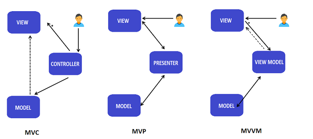
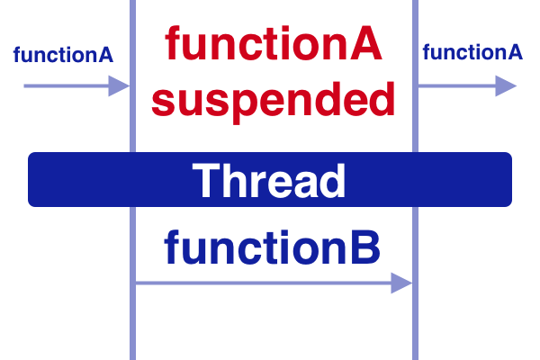
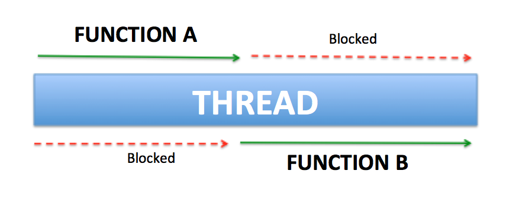
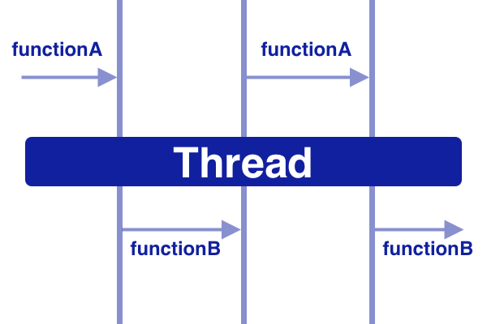

# Kotlin Basics
## Intro

Developed by **JetBrains** (creator of IntelliJ IDEA) from the 2010s. The name comes from Kotlin Island (near St. Petersburg)

**general-purpose** - used in wide variety of domains. Support for various programming paradigms (object-oriented, functional, imperative, procedural)  
**cross-platform** - targets JVM, JavaScript (frontend, React), native code (LLVM, iOS)  
**statically typed**

**2012** - Open Sourced  
**2016** - Version 1.0 release  
**2017** - adopted by Google for the Android Platform  
**2019** - announced as preferred language for Android apps, #1 language on Android official documentation  


## Kotlin/Java Compatibility

**compiled to Java bytecode** java and kt files compile to the same class files  
**interoperability** Java and Kotlin work great together  

## Hello World
```
fun main() {
//sampleStart
println("Hello Android!")
//sampleEnd
}
```

### Java to Kotlin Example
```
//sampleStart
public void updateWeather(int degrees) {
    String description;
    Color color;
    if(degrees < 5) {
      description = "cold";
      color = BLUE;
    } else if(degrees <23) {
      description = "mild";
      color = ORANGE;
    } else {
      description = "hot";
      color = RED;
    }
    
}
//sampleEnd

```

```
//sampleStart
fun updateWeather(degrees: Int) {
  val (description, color) = when {
    degrees < 5 -> "cold" to BLUE
    degrees < 23 -> "mild" to ORANGE
    else -> "hot" to RED
  }
}
//sampleEnd

```   


## Basic Types
### Type inference 
Deduce the type of an expression at compile time.
```
fun main() {
//sampleStart
val x = 2021

print(x::class.qualifiedName)
//sampleEnd
}
```

### Primitives
**In Kotlin every primitive is represented as an object** (Boolean, Int, Long, Double ...).

*Boxing* - convert primitives to enclosing object wapper (Java: **int -> Integer**)  
*Unboxing* - reverse of boxing  (Java: **Integer -> int**)  
*Autoboxing* - compiler performs conversion

```
fun main() {
//sampleStart
val isVisible = true // Boolean

val width = 100 // Int

val timestamp = 1611747645804L // Long

val latitude = 46.769552 // Double

val temperature = 15.3f // Float

val oneByte: Byte = 1 // Byte
//sampleEnd
println("isVisible: ${isVisible::class.simpleName}")
println("width: ${width::class.simpleName}")
println("timestamp: ${timestamp::class.simpleName}")
println("latitude: ${latitude::class.simpleName}")
println("temperature: ${temperature::class.simpleName}")
println("oneByte: ${oneByte::class.simpleName}")
}
```

### Conversions

**No implicit widening conversions for numbers in Kotlin.**  

```
fun main() {
//sampleStart
val a: Int = 1
val b: Long = a
//sampleEnd
}
```
#### Dividing Ints
```
fun main() {
//sampleStart
val sum = 1L + 2

val div = 5 / 2
//sampleEnd
println("div: ${div::class.simpleName}")
}
```

To return a floating-point type, explicitly convert one of the arguments to a floating-point type.  

```
fun main() {
//sampleStart
val sum = 1L + 2

val div = 5 / 2.toDouble()
//sampleEnd
println("div: ${div::class.simpleName}")
}
```

### Literals

There are the following kinds of literal constants for integral values:  
Decimals: 123  
Longs are tagged by a capital L: 123L  
Hexadecimals: 0x0F  
Binaries: 0b00001011  

```
fun main() {
//sampleStart
val salary = 9_000_000 // $$$

val binary = 0b00001011

val hex = 0xFFAABB55

//sampleEnd
println("salary: ${salary::class.simpleName}")
println("binary: ${binary::class.simpleName}")
println("hex: ${hex::class.simpleName}")
}
```

### Operations
Kotlin supports the standard set of arithmetical operations over numbers: +, -, *, /, %..

```
fun main() {
//sampleStart

println(1 + 2)
println(2_500_000_000L - 1L)
println(3.14 * 2.71)
println(10.0 / 3)

//sampleEnd
}
```

### val vs. var

**val** - read-only (equivalent to Java *final*)  
**var** - can be reassigned (*mutable*)

```
fun main() {
//sampleStart
val socialIdentityNumber = 1990129123456
socialIdentityNumber = 1880414567890

var temperature = 5.4
temperature = 12.0
//sampleEnd
}
```

### Arrays

```
fun main() {
//sampleStart
val arr = arrayOf(1, 2, 3)
print(arr.contentToString())
//sampleEnd
}
```

```
fun main() {
//sampleStart
val arr = intArrayOf(1, 2, 3)
println(arr.contentToString())

val arr2 = doubleArrayOf(0.5, 2.08, 3.14)
println(arr2.contentToString())

//sampleEnd
}
```

```
fun main() {
//sampleStart
val arr = Array(10) { i -> 2 shl i }
print(arr.contentToString())
//sampleEnd
}
```

### Strings

```
fun main() {
//sampleStart
val str = "Welcome to Kotlin!"

// lenght of a string
println(str.length)

// characters can be accessed as an array
println(str[0])

// substring [inclusive - exclusive)
println(str.substring(11, 17))

// iterated over characters in for loop
for (letter in str) print("$letter ")
//sampleEnd
}
```

**Strings are *immutable* in Kotlin.**

```
fun main() {
//sampleStart
val str = "Welcome to Kotlin!"

str[0] = 'w'

//sampleEnd
}
```

#### Strings Templates
Embed a variable or expression inside a string without string concatenation.
```
import java.util.Date

fun main() {
//sampleStart
val count = 6
val price = 3.5
val timestamp = 1611747645804L

val str = "You purchased $count items, in a total price of ${count * price}, on ${Date(timestamp)}"

print(str)

//sampleEnd
}
```

## Control Flows
### If Expressions
'If' can be used either as an expression or as a statement. It has the role of the ternary operator.
```
import kotlin.random.Random

fun main() {
//sampleStart
val x = Random.nextInt()

// statement
if (x % 2 == 0) { 
println("even")
} else {
println("odd")
}

// expression (else is mandatory)
val result = if (x % 2 == 0) "even" else "odd"
println(result)

//sampleEnd
}
```

> <span style="color: indianred;">**Prefer expressions to make the code more concise**</span>

### When Expressions
'When' replaces Java *switches*. Can be used either as an expression or as a statement.

```
fun main() {
//sampleStart

val colorStr = "red"

// expression
val colorCode = when (colorStr) {
"red" -> 0xFF0000
"green" -> 0x00FF00
"blue" -> 0x0000FF
// else is mandatory
}

println(colorCode.toString(16))

//sampleEnd
}
```

```
import kotlin.random.Random

fun main() {
//sampleStart

val salary = Random.nextInt()

// statement
when { // no argument
salary < 0 -> println("You owe some money to the company!")
salary in 0..20 -> println("To low. Get another job!")
else -> println("Not bad!")
}

//sampleEnd
}
```

### Loops
```
fun main() {
//sampleStart

for (i in 1..5) {
    println(i)
}

println()

for (i in 10 downTo 0 step 2) {
    println(i)
}

println()

val temperatures = floatArrayOf(10.5f, 4.8f, 23.1f, -5.0f)

for (temperature: Float in temperatures) println(temperature)

//sampleEnd
}
```

```
import kotlin.random.Random

fun main() {
//sampleStart
var i = 0 // note the 'var'
while (i < 5) {
    println(i++)
}

println()

val availableCommands = arrayOf("forward", "back", "left" , "right", "exit")
do {
    var command = availableCommands[Random.nextInt(0, availableCommands.size)] // note the 'var'
    println(command)
} while (command != "exit") // command is visible here!

//sampleEnd
}
```

## Bassic OOP
### Classes
```
fun main() {
//sampleStart
class Customer { /*...*/ }
//sampleEnd
}
```
### Constructors
```
fun main() {
//sampleStart
class Customer constructor(firstName: String, lastName: String) { /*...*/ }
// 'constructor' keyword optional in this case 
//sampleEnd
}
```

#### Istantiation
```
fun main() {
class Customer constructor(firstName: String, lastName: String) { /*...*/ }
//sampleStart
Customer("Roman", "Elizarov") // no 'new' keyword needed
//sampleEnd
}
```


#### Init Blocks
```
fun main() {
//sampleStart
class Customer constructor(firstName: String, lastName: String) {
init {
println("Customer name is $firstName $lastName")
}
}

Customer("Roman", "Elizarov")
//sampleEnd
}
```

#### Secondary Constructors

```
fun main() {
//sampleStart
class Customer constructor(firstName: String, lastName: String) {
init {
println("Customer name is $firstName $lastName")
}

constructor(csv: String): this(csv.split(",")[0], csv.split(",")[1]) {
println("Secondary constructor called with $csv")
}
}

Customer("Andrey,Breslav")
//sampleEnd
}
```

### Properties

```
fun main() {
//sampleStart
class Product() {
val name = "Galaxy S21"
val manufacturer = "Samsung"
var price = 799.0
}

val product = Product()

println(product.name) // get
product.price = 599.0 // set
println(product.price) // get

//sampleEnd
}
```

```
fun main() {
//sampleStart
class Product() {
val name = "Galaxy S21"
val manufacturer = "Samsung"
val description
  get() = "Name: $name, manufactured by: $manufacturer, current price: $price"
var price = 799.0
  private set
}

val product = Product()

product.price = 599.0 // set is private !!!
println(product.description) // get

//sampleEnd
}
```

```
fun main() {
//sampleStart
class Product(val name: String, val manufacturer: String, var price: Double) {
val description
  get() = "Name: $name, manufactured by: $manufacturer, current price: $price"
}

val product = Product("Galaxy S21", "Samsung", 599.0)

println(product.description) // get

//sampleEnd
}
```

### Inheritance
In Kotlin every class inherits from 'Any', which has three methods: equals(), hashCode() and toString()  

**Kotlin classes are final by default**

> <span style="color: indianred;">**Prefer composition over inheritance**</span>

```
fun main() {
//sampleStart
open class Widget(text: String) // mark class open for extension

class Button(text: String): Widget(text) // extend class

class Label(text: String): Widget(text) // extend class

//sampleEnd
}
```

#### Overriding Functions and Properties

Both functions and properties can be overriden, but need to be marked as such.

```
fun main() {
//sampleStart
open class Widget(open val text: String) {
open val color = 0xFF_FF_FF // white
open fun draw() { println("Drawing widget: $text (color ${color.toString(16)})") }
}

class Button(override val text: String): Widget(text) {
override val color = 0x00_00_FF // blue
override fun draw() { println("Drawing button: $text (color ${color.toString(16)})") }
}

Widget("Header").draw()
Button("Play").draw()

//sampleEnd
}
```

### Visibility
**In Kotlin everything is 'public' by default (implicitly).**

| Modifier      | Description                                     |
|---------------|:-----------------------------------------------:|
| public        | visible everywhere                              |
| private       | visible inside this class only                  |
| protected     | visible inside this class and in subclasses too |
| internal      | visible inside this module                      |

### Data Classes

Designed to hold data. All constructor parameters need to be 'val' or 'var'.  
The following methods are generated: equals(), hashCode(), toString(), copy()

```
public final class PointOfInterest {
   @NotNull
   private final String name;
   private final double latitude;
   private final double longitude;
   @NotNull
   private final String poiType;

   @NotNull
   public final String getName() {
      return this.name;
   }

   public final double getLatitude() {
      return this.latitude;
   }

   public final double getLongitude() {
      return this.longitude;
   }

   @NotNull
   public final String getPoiType() {
      return this.poiType;
   }

   public PointOfInterest(@NotNull String name, double latitude, double longitude, @NotNull String poiType) {
      Intrinsics.checkParameterIsNotNull(name, "name");
      Intrinsics.checkParameterIsNotNull(poiType, "poiType");
      super();
      this.name = name;
      this.latitude = latitude;
      this.longitude = longitude;
      this.poiType = poiType;
   }

   @NotNull
   public final String component1() {
      return this.name;
   }

   public final double component2() {
      return this.latitude;
   }

   public final double component3() {
      return this.longitude;
   }

   @NotNull
   public final String component4() {
      return this.poiType;
   }

   @NotNull
   public final PointOfInterest copy(@NotNull String name, double latitude, double longitude, @NotNull String poiType) {
      Intrinsics.checkParameterIsNotNull(name, "name");
      Intrinsics.checkParameterIsNotNull(poiType, "poiType");
      return new PointOfInterest(name, latitude, longitude, poiType);
   }

   // $FF: synthetic method
   public static PointOfInterest copy$default(PointOfInterest var0, String var1, double var2, double var4, String var6, int var7, Object var8) {
      if ((var7 & 1) != 0) {
         var1 = var0.name;
      }

      if ((var7 & 2) != 0) {
         var2 = var0.latitude;
      }

      if ((var7 & 4) != 0) {
         var4 = var0.longitude;
      }

      if ((var7 & 8) != 0) {
         var6 = var0.poiType;
      }

      return var0.copy(var1, var2, var4, var6);
   }

   @NotNull
   public String toString() {
      return "PointOfInterest(name=" + this.name + ", latitude=" + this.latitude + ", longitude=" + this.longitude + ", poiType=" + this.poiType + ")";
   }

   public int hashCode() {
      String var10000 = this.name;
      int var1 = (var10000 != null ? var10000.hashCode() : 0) * 31;
      long var10001 = Double.doubleToLongBits(this.latitude);
      var1 = (var1 + (int)(var10001 ^ var10001 >>> 32)) * 31;
      var10001 = Double.doubleToLongBits(this.longitude);
      var1 = (var1 + (int)(var10001 ^ var10001 >>> 32)) * 31;
      String var2 = this.poiType;
      return var1 + (var2 != null ? var2.hashCode() : 0);
   }

   public boolean equals(@Nullable Object var1) {
      if (this != var1) {
         if (var1 instanceof PointOfInterest) {
            PointOfInterest var2 = (PointOfInterest)var1;
            if (Intrinsics.areEqual(this.name, var2.name) && Double.compare(this.latitude, var2.latitude) == 0 && Double.compare(this.longitude, var2.longitude) == 0 && Intrinsics.areEqual(this.poiType, var2.poiType)) {
               return true;
            }
         }

         return false;
      } else {
         return true;
      }
   }
}
//sampleStart

data class PointOfInterest(val name: String, 
                           val latitude: Double, 
                           val longitude: Double, 
                           val poiType: String)

//sampleEnd
```

### Abstract Classes
Abstract classes can not be instantiated.  
Abstract member does not have an implementation in its class.

```
abstract class Shape {
    abstract fun area(): Double
}

class Rectangle(val w: Double, val h: Double): Shape() {
    override fun area() = w * h
}

fun main() { println(Rectangle(2.0, 3.0).area()) }

```

### Interfaces
A class or object can implement one or more interfaces.  
Interfaces can have implementation, but cannot store state.

```
interface TemperatureSensorListener {
    fun onTemperatureChanged(temp: Float)
    fun convertToFarenheit(temp: Float) = ((temp *9 ) / 5) + 32;
}

class TempApp(): TemperatureSensorListener {
    override fun onTemperatureChanged(temp: Float) {
        println("Temperature is ${convertToFarenheit(temp)} °F")
    }
}

fun main() { TempApp().onTemperatureChanged(30.5f) }

```

### Objects
#### Object Expressions
Create and ad-hoc extension of a class or implementation of an interface.  
Object expressions are executed and initialized **immediately**.

```
interface GestureListener {
    fun onSingleTap()
    fun onDoubleTap()
    fun onScroll()
    fun onFling()
}

class View {
    fun addGestureListener(listener: GestureListener) { }
}

fun main() {
//sampleStart
    View().addGestureListener(object : GestureListener {
        override fun onSingleTap() { /* ... */ }
        override fun onDoubleTap() { /* ... */ }
        override fun onScroll() { /* ... */ }
        override fun onFling() { /* ... */ }
    })
//sampleEnd
}
```

#### Object Declarations
Built in feature to create singletons.  
Object declarations are initialized **lazily** when accessed for the first time

```
object DataProvider {
    fun queryDatabase(query: String): String = /* ... */ "result"
}

fun main() {
    DataProvider.queryDatabase("SELECT * FROM table")
}

```

### Companion Objects
Kotlin doesn't have 'static' keyword, but allows classes to have one associated object declared.  
A companion object is initialized when the corresponding class is loaded.

```
class Temperature(val celsius: Float) {
    companion object {
        fun fromFahrenheit(fahrenheit: Float) = Temperature((5 * (fahrenheit - 32.0f)) / 9.0f)
        
        fun fromKelvin(kelvin: Float) = Temperature(kelvin - 273.15f)
    }
}

fun main() {
    println(Temperature.fromFahrenheit(90f).celsius)
}
```

#### Constants
Equivalent of 'static final' in Java

```
//sampleStart
class Temperature(val celsius: Float) {
    companion object {
        const val KELVIN_TO_CELSIUS = -273.15f
        fun fromKelvin(kelvin: Float) = Temperature(kelvin + KELVIN_TO_CELSIUS)
    }
}

//sampleEnd
fun main() {
    println(Temperature.fromKelvin(300f).celsius)
}
```

### Enum Classes
```
enum class Language(val isoCode: String) {
    ENGLISH("en"),
    FRENCH("fr"),
    GERMAN("de"),
    SPANISH("es"),
    /* ... */
}

fun main() {
    println(Language.values().contentToString())
}
```

### Sealed Classes

```
sealed class Sensor {
    data class Wind(val speed: Float, val direction: Float): Sensor()
    data class Light(val luminosity: Int): Sensor()
    data class Temperature(val temperture: Float): Sensor()
    data class Odometer(val distance: Double): Sensor()
}

object SensorDisplay {
    fun displaySensor(sensor: Sensor) = print(
        when(sensor) {
            is Sensor.Wind -> "Wind is blowing at ${sensor.speed} km/h from ${sensor.direction} °T"
            is Sensor.Light -> "Luminosity is ${sensor.luminosity}"
            is Sensor.Temperature -> "Temperature is ${sensor.temperture}"
            is Sensor.Odometer -> "Covered distance: ${sensor.distance}"
        })
}

fun main() {
    SensorDisplay.displaySensor(Sensor.Wind(10.0f, 90.5f))
}
```

## Null Safety
Eliminate the risk of null references ('NullPointerException')  
Distinguish between references that can hold null and the ones that can not.

```
fun main() {
//sampleStart
class Bitcoin { fun sell() { print("make some money") } }

var wallet = Bitcoin()

wallet = null
//sampleEnd
}
```

> <span style="color: indianred;">**Prefer using non-nullable types**</span>

#### Working With Nullables

```
fun main() {
class Bitcoin { fun sell() { println("make some money") } }
//sampleStart

var wallet: Bitcoin? = Bitcoin()

// 1. Safe calls (recommended)

wallet?.sell()


// 2. Null check consitions

if (wallet != null) wallet.sell()


// 3. !! operator (try to avoid!!!)

wallet!!.sell()


//sampleEnd
}
```

#### Elvis Operator

```
fun main() {
class Bitcoin { fun sell() { println("make some money") } }
//sampleStart

var wallet: Bitcoin? = null

wallet?.sell() ?: println("Oh no! Empty wallet!")

//sampleEnd
}
```

## Equality

| Kotlin  | Java     | Description          |
|---------|:--------:|---------------------:|
| **=**   | **=**    | assignment           |
| **==**  | equals() | structural equality  |
| **===** | **==**   | referential equality |

```
fun main() {
//sampleStart

data class SmartPhone(val imei: Long) // note that it is data class

val a = SmartPhone(1111_2222_3333_4444)
val b = SmartPhone(1111_2222_3333_4444)
val c = SmartPhone(9999_8888_7777_6666)
val d = a

println("a == b : ${a == b}")
println("a == c : ${a == c}")
println("a == d : ${a == d}")
println("--------------------")
println("a === b : ${a === b}")
println("a === c : ${a === c}")
println("a === d : ${a === d}")

//sampleEnd
}
```

```
fun main() {
//sampleStart
// String comparison works with == (equals in Java)

val a = "kotlin"
val b = "kot" + "lin"

println(a == b)

//sampleEnd
}
```

## Functions
```
fun main() {
//sampleStart
fun getGrossPrice(nettoPrice: Float, taxPercent: Float): Float {
    return nettoPrice * (100 + taxPercent) / 100
}

println(getGrossPrice(100f, 19f))

//sampleEnd
}
```

### Default and Named Arguments

```
fun main() {
//sampleStart
fun encrypt(message: String, key: String = "65dd8dc686a2061", algorithm: String = "aes" ) {
    print("$message $key $algorithm")
}

encrypt("are you there?", algorithm = "rsa")

//sampleEnd
}
```

### Lambdas
In Kotlin functions can be stored in variables and data structures, passed as arguments and returned from other functions.  

**higher-order function** takes functions as parameters, or returns a function.

```
(A, B) -> R
(A) -> R
() -> R
() -> Unit
A.(B) -> R // receiver

```

#### Lambda Expressions

```
fun main() {
//sampleStart
//variable |    type     |    params     |     body
   val square: (Int) -> Int = { number: Int -> number * number }

println(square(3))

//sampleEnd
}
```

#### Single Lambda Argument 'it'

```
fun main() {
//sampleStart
val square: (Int) -> Int = { it * it }

println(square(2))

//sampleEnd
}
```

#### Trailing Lambdas

```
class Request
class Response

object ServerAPIManager {
    fun sendRequest(request: Request, listener: (returnCode: Int, response: Response) -> Unit) {
       // call server
       println("Making request $request")
       val response = Response()
       val code = 200
       
       // dispatch result
       listener(code, response) 
    }
}

fun main() {
    val request = Request()
    ServerAPIManager.sendRequest(request) { returnCode, response ->
        println("Server returned $returnCode")
        // update UI with response
    }
}

```

#### Lambdas with Receiver

```
fun main() {
//sampleStart
fun buildString(block: StringBuilder.() -> Unit): String {
    val sb = StringBuilder()
    sb.block()
    return sb.toString()
}

val str = buildString { // we are in the context of a StringBuilder
    append("Koltinise ")
    append("your ")
    append("Android!")
}

println(str)

//sampleEnd
}

```

### Extension Functions
Extend a class with new functionality without having to inherit from the class.  
Extension functions can be called such as they were methods of the class thet extend.

```
fun String.swap(index1: Int, index2: Int): String {
   if (index1 >= this.length || index2 >= this.length) return this
   
   val chars = toCharArray()
   val tmp = chars[index1]
   chars[index1] = chars[index2]
   chars[index2] = tmp
   
   return String(chars)
}

fun main() {
    println("AC/DC".swap(0,4))
}

```

### Scope Functions
Execute a block of code within the context of an object.  

| Function  | Reference | Return         | Is extension function?
|-----------|:---------:|---------------:|---------------------------------------------|
| **let**   | it        | Lambda result  | Yes                                         |
| **run**   | this      | Lambda result  | Yes                                         |
| **with**  | this      | Lambda result  | No: takes the context object as an argument |
| **apply** | this      | Context object | Yes                                         |
| **also**  | it        | Context object | Yes                                         |

#### Reference context object: 'it' vs 'this'

```
fun main() {
//sampleStart
data class PointOfInterest(var name: String, var latitude: Double, var longitude: Double, var poiType: String)

// let ('it')
fun editName(poi: PointOfInterest, newName: String?) {
   newName?.let{ poi.name = it } // works in combination with safe-call
}

// apply ('this' - implicit)
fun movePoi(poi: PointOfInterest, newLatitude: Double, newLongitude: Double) {
   poi.apply {
      latitude = newLatitude
      longitude = newLongitude
   }
}

//sampleEnd
    val poi = PointOfInterest("First Hotel", 0.0, 0.0, "accomodation")
    println(poi)
    editName(poi, "Hotel Duo")
    movePoi(poi, 5.5, 5.5)
    println(poi)
}
```

#### Return Value

```
fun main() {
fun buildString2(block: StringBuilder.() -> Unit): String {
    val sb = StringBuilder()
    sb.block()
    return sb.toString()
}
//sampleStart

// also (return context object)
fun buildString(block: StringBuilder.() -> Unit) = StringBuilder().also { it.block() }.toString()

//sampleEnd
val str = buildString { // we are in the context of a StringBuilder
    append("Koltinise ")
    append("your ")
    append("Android!")
}

println(str)
}

```


```
fun main() {
//sampleStart

// run (return lambda result)
fun buildString(block: StringBuilder.() -> Unit) = StringBuilder().run { 
   block()
   toString()
}

//sampleEnd
val str = buildString { // we are in the context of a StringBuilder
    append("Koltinise ")
    append("your ")
    append("Android!")
}

println(str)
}

```


### Inline Functions
For each lambda passed as arguments to a higher-order function an object is created under the hood. 

```
// Kotlin
fun main() {
//sampleStart
fun wrapper(block: () -> Unit) {
    println("before")
    block()
    println("after")
}

wrapper {
    println("do something")
}
//sampleEnd
}
```

The above code generates the following conceptual Java code:

```
// Java/bytecode
public void wrapper(Function block) {
    System.out.println("before");
    block.invoke(int);
    System.out.println("after");
}

wrapper(new Function() {
    @Override
    public void invoke() {
        System.out.println("do something");
    }
});

```

Solution: use 'inline'

```
// Kotlin
inline fun wrapper(block: () -> Unit) { // note the 'inline'
    println("before")
    block()
    println("after")
}

fun main() {
    wrapper {
        println("do something")
    }
}

```

```
// Java/bytecode

System.out.println("before");
System.out.println("do something");
System.out.println("after");

```


Lambdas are represented as objects behind the scenes, which introduces runtime overhead.


## Collections
Main data structures: Lists, Sets, Maps.  
All of those can be either 'immutable' (by default) or 'mutable'.

### Lists

Stores elements in a specified order and provides indexed access to them.

```
enum class Genre { DRAMA, COMEDY, ACTION, HORROR, THRILLER }

data class Movie(val title: String, val genre: Genre, val year: Int, val lenghtInMin: Int)

fun main() {

    val movieLibrary = listOf(Movie("Blood Diamond", Genre.DRAMA, 2006, 143), 
                              Movie("Rush", Genre.ACTION, 2013, 123), 
                              Movie("The Wolf of Wall Street", Genre.COMEDY, 2013, 180))

    println(movieLibrary.get(0))
    
    println(movieLibrary[1])
    
    println(movieLibrary.size)
    
    println(movieLibrary.sumBy { it.lenghtInMin })
    
    println(movieLibrary.minByOrNull { it.year }?.title)
    
    println(movieLibrary.filter { it.genre == Genre.DRAMA })
    
    println(movieLibrary.map { it.title })
}
```

```
enum class Genre { DRAMA, COMEDY, ACTION, HORROR, THRILLER }

data class Movie(val title: String, val genre: Genre, val year: Int, val lenghtInMin: Int)

fun main() {
//sampleStart
    val movieLibrary = listOf(Movie("Blood Diamond", Genre.DRAMA, 2006, 143), 
                              Movie("Rush", Genre.ACTION, 2013, 123), 
                              Movie("The Wolf of Wall Street", Genre.COMEDY, 2013, 180))

   movieLibrary.add(Movie("Bohemian Rhapsody", Genre.DRAMA, 2018, 133))
//sampleEnd
}
```

### Sets
Stores unique elements. Element order is generally undefined (except for LinkedHashSet)

```
enum class Genre { DRAMA, COMEDY, ACTION, HORROR, THRILLER }

data class Movie(val title: String, val genre: Genre, val year: Int, val lenghtInMin: Int)

fun main() {
//sampleStart
    val movieLibrary = mutableSetOf(Movie("Blood Diamond", Genre.DRAMA, 2006, 143), 
                              Movie("Rush", Genre.ACTION, 2013, 123), 
                              Movie("The Wolf of Wall Street", Genre.COMEDY, 2013, 180))

   println(movieLibrary.add(Movie("Blood Diamond", Genre.DRAMA, 2006, 143)))
   
   println(movieLibrary.union(setOf(Movie("Bohemian Rhapsody", Genre.DRAMA, 2018, 133))))
   
//sampleEnd
}
```

### Maps
Stores key-value pairs. Keys are unique.

```
enum class Genre { DRAMA, COMEDY, ACTION, HORROR, THRILLER }

data class Movie(val title: String, val genre: Genre, val year: Int, val lenghtInMin: Int)

fun main() {

    val movieLibrary = mutableSetOf(Movie("Blood Diamond", Genre.DRAMA, 2006, 143), 
                              Movie("Rush", Genre.ACTION, 2013, 123),
                              Movie("Bohemian Rhapsody", Genre.DRAMA, 2018, 133),
                              Movie("The Wolf of Wall Street", Genre.COMEDY, 2013, 180))

//sampleStart

val movieMap = movieLibrary.associateBy{ it.genre }

println(movieMap)
   
//sampleEnd
}
```

```
enum class Genre { DRAMA, COMEDY, ACTION, HORROR, THRILLER }

data class Movie(val title: String, val genre: Genre, val year: Int, val lenghtInMin: Int)

fun main() {

    val movieLibrary = mutableSetOf(Movie("Blood Diamond", Genre.DRAMA, 2006, 143), 
                              Movie("Rush", Genre.ACTION, 2013, 123),
                              Movie("Bohemian Rhapsody", Genre.DRAMA, 2018, 133),
                              Movie("The Wolf of Wall Street", Genre.COMEDY, 2013, 180))

val movieMap = movieLibrary.associateBy{ it.genre }

//sampleStart
    val editableMovieMap = movieMap.toMutableMap()

    println(editableMovieMap.get(Genre.DRAMA))
    println(editableMovieMap[Genre.COMEDY])

    editableMovieMap.put(Genre.THRILLER, Movie("The Hunt", Genre.THRILLER, 2020, 115))
    println(editableMovieMap)
   
//sampleEnd
}
```

> <span style="color: indianred;">**Prefer collection specific operations (filter, map, find ...) instead of loops (for, while) to make the code more concise**</span>

## Immutability
Once created, an object/variable cannot be changed. Immutable objects are thread safe. 
Easier logic, no race conditions, no concurrency problems, no need to sync.  

Kotlin encourages immutability by:

> <span style="color: indianred;">**Prefer using 'val' instead of 'var'.**</span>

> <span style="color: indianred;">**Prefer using immutable collections.**</span>

## Delegation
Reuse code through composition.

```
interface HighwayConstrcutionContract {
    fun buildRoads()
    fun buildBridges()
    fun collectPayment()
}

class BigCompany(contractor: Subcontractor): HighwayConstrcutionContract by contractor {
    override fun collectPayment() { println("BIG COMPANY makes BIG MONEY!") }
}

class Subcontractor(): HighwayConstrcutionContract {
    override fun buildRoads() { println("SUBCONTRACTOR actually building the roads") }
    override fun buildBridges() { println("SUBCONTRACTOR actually building the bridges") }
    override fun collectPayment() { println("SUBCONTRACTOR barely get paid") }
}

fun main() {
    BigCompany(Subcontractor()).apply {
        buildRoads()
        buildBridges()
        collectPayment()
    }
}

```

### Delegated Properties

#### Lazy


```
class Student {
    val homework: String by lazy { 
        println("Busy doing homework!")
        "some nice Kotlin code"
    }
    
    fun showHomework() {
        println("Presenting homework: $homework")
    }
}

fun main() {
    Student().apply {
        showHomework()
        showHomework()
        showHomework()
    }
}

```

# Android Components

## App Bar 

The app bar, also known as the action bar, is one of the most important design elements in your app's activities, because it provides a visual structure and interactive elements that are familiar to users. Using the app bar makes your app consistent with other Android apps, allowing users to quickly understand how to operate your app and have a great experience

### The Toolbar Widget

Using the Toolbar Widget as an app bar makes it easy to set up an app bar that works on the widest range of devices and gives room to customization

Add dependencies to gradle

```
implementation 'androidx.appcompat:appcompat:1.2.0'
implementation 'com.google.android.material:material:1.3.0'
```

Make sure Activity extends AppCompatActivity

```
class MyActivity : AppCompatActivity() {
  // ...
}
```

In the app manifest, set the <application> element to use one of the NoActionBar themes

```
<application
    android:theme="@style/Theme.MaterialComponents.DayNight.NoActionBar"
    />
```

Add a Toolbar to the Activity's layout

```
<androidx.appcompat.widget.Toolbar
  android:id="@+id/my_toolbar"
  android:layout_width="match_parent"
  android:layout_height="?attr/actionBarSize"
  android:elevation="4dp"
  android:theme="@style/ThemeOverlay.MaterialComponents.Dark.ActionBar"
  app:popupTheme="@style/ThemeOverlay.MaterialComponents.Dark"/>
```

In the activity's onCreate() method, call the activity's setSupportActionBar() method

```
override fun onCreate(savedInstanceState: Bundle?) {
    super.onCreate(savedInstanceState)
    setContentView(R.layout.activity_my)
    //sampleStart
    setSupportActionBar(findViewById(R.id.my_toolbar))
    //sampleEnd
}
```

## Options Menu

The options menu is where you should include actions and other options that are relevant to the current activity context, such as "Search," "Compose email," and "Settings."

### Defining a Menu in XML

To define the menu, create an XML file inside your project's res/menu/ directory 

```
<?xml version="1.0" encoding="utf-8"?>
<menu xmlns:android="http://schemas.android.com/apk/res/android"
    xmlns:app="http://schemas.android.com/apk/res-auto">

    <item
        android:id="@+id/action_sort"
        android:icon="@drawable/ic_map"
        android:title="@string/label_sort"
        app:showAsAction="never"/>

</menu>
```
### Attach an Options Menu

To specify the options menu for an activity, override onCreateOptionsMenu() (fragments provide their own onCreateOptionsMenu() callback)

```
override fun onCreateOptionsMenu(menu: Menu): Boolean {
    val inflater: MenuInflater = menuInflater
    inflater.inflate(R.menu.game_menu, menu)
    return true
}
```

### Handle Options Menu interractions

When the user selects an item from the options menu (including action items in the app bar), the system calls your activity's onOptionsItemSelected() method.

```
override fun onOptionsItemSelected(item: MenuItem): Boolean {
    // Handle item selection
    return when (item.itemId) {
        R.id.new_game -> {
            newGame()
            true
        }
        R.id.help -> {
            showHelp()
            true
        }
        else -> super.onOptionsItemSelected(item)
    }
}
```

## Dialogs

A dialog is a small window that prompts the user to make a decision or enter additional information. A dialog does not fill the screen and is normally used for modal events that require users to take an action before they can proceed.

The Dialog class is the base class for dialogs and it should not be used, but the following subclasses:

  + AlertDialog
  A dialog that can show a title, up to three buttons, a list of selectable items, or a custom layout.
  
  + DatePickerDialog or TimePickerDialog
  A dialog with a pre-defined UI that allows the user to select a date or time.

These classes define the style and structure for your dialog, but you should use a DialogFragment as a container for your dialog. 
Using DialogFragment to manage the dialog ensures that it correctly handles lifecycle events such as when the user presses the Back button or rotates the screen. The DialogFragment class also allows you to reuse the dialog's UI as an embeddable component in a larger UI, just like a traditional Fragment (such as when you want the dialog UI to appear differently on large and small screens).

### Creating a Dialog Fragment


#### Simple Dialog

Create a simple dialog by extending DialogFragment and creating a AlertDialog in the onCreateDialog() callback method.

```
class FireMissilesDialogFragment : DialogFragment() {

    override fun onCreateDialog(savedInstanceState: Bundle): Dialog {
        return activity?.let {
            // Use the Builder class for convenient dialog construction
            val builder = AlertDialog.Builder(it)
            builder.setMessage(R.string.dialog_fire_missiles)
                    .setPositiveButton(R.string.fire,
                            DialogInterface.OnClickListener { dialog, id ->
                                // FIRE ZE MISSILES!
                            })
                    .setNegativeButton(R.string.cancel,
                            DialogInterface.OnClickListener { dialog, id ->
                                // User cancelled the dialog
                            })
            // Create the AlertDialog object and return it
            builder.create()
        } ?: throw IllegalStateException("Activity cannot be null")
    }
}
```


#### AlertDialog anatomy

There are three regions of an alert dialog
  + Title - This is optional and should be used only when the content area is occupied by a detailed message, a list, or custom layout
  + Content Area - This can display a message, a list, or other custom layout.
  + Action buttons - There should be no more than three action buttons in a dialog.
  


#### Adding a list

There are three kinds of lists available with the AlertDialog APIs:

  + A traditional single-choice list
  + A persistent single-choice list (radio buttons)
  + A persistent multiple-choice list (checkboxes)

```
class PoiSortDialogFragment : DialogFragment() {
    override fun onCreateDialog(savedInstanceState: Bundle?): Dialog {
        return activity?.let {
            val builder = AlertDialog.Builder(it)
            builder.setTitle(R.string.title_sort_dialog)
                .setSingleChoiceItems(R.array.poi_sort_array, 0) 
                { dialogInterface: DialogInterface, i: Int ->
                    preferences.edit {
                    putInt(getString(R.string.key_sort_order), i)
                }
            }
            builder.create()
        } ?: throw IllegalStateException("Activity cannot be null")
    }
}
```

#### Showing an AlertDialog

When you want to show your dialog, create an instance of your DialogFragment and call show(), passing the FragmentManager and a tag name for the dialog fragment.

```
fun confirmFireMissiles() {
    val newFragment = FireMissilesDialogFragment()
    newFragment.show(supportFragmentManager, "missiles")
}
```


# Android App Architecture

## Common architectural principles

* **Separation on concerns**
  + Activities and Fragments should only contain logic that handles UI and OS interactions
  + Keep these classes as lean as possible
  + Minimize your dependency on them

* **Drive UI from a model**
  + Models are components that are responsible for handling the data for an app. 
  + They're independent from the View objects and app components in your app, so they're unaffected by the app's lifecycle and the associated concerns

## MVC - MVP - MVVM



## Recommended app architecture


## **ViewModel**

* ViewModel is a helper class for the UI controller that is responsible for preparing data for the UI. 
*	Contains data-handling business logic to communicate with the model
*	ViewModel objects are automatically retained during configuration changes so that data they hold is immediately available to the next activity or fragment instance
* ViewModel objects are scoped to the Lifecycle passed to the ViewModelProvider when getting the ViewModel
* The ViewModel remains in memory until the Lifecycle it's scoped to goes away permanently: in the case of an activity, when it finishes, while in the case of a fragment, when it's detached

    

## **Repository**

*	Repositories handle data operations 
*	They Provide a clean API so that the rest of the app can retrieve this data easily
*	Repositories Know where to get the data from and what API calls to make when data is updated 
*	You can consider repositories to be mediators between different data sources

## **LiveData**

*	LiveData is an observable data holder class
* LiveData only notifies **active observers** about updates
*	LiveData considers an observer to be in an active state if its lifecycle is in the **STARTED** or **RESUMED** state
*	An observer is removed when the state of the corresponding Lifecycle object changes to **DESTROYED**
*	Advantages:
    +	Ensures your UI matches your data state
    +	No memory leaks
    +	No crashes due to stopped activities
    +	No more manual lifecycle handling
    +	Always up to date data
    +	Proper configuration changes
    
# Threading

## **Coroutines**

* Concurrency design patterns you can use to simplify code that executes asynchronously
* A way of writing asynchronous code in a synchronous way
* Light-Weight Threads
* Rely on suspending functions
* Non-blocking style of Programming

## Suspending Functions

* Functions that could be started, paused, and resumed


    
* BLOCKING: Function A has to be completed before Function B continues. The thread is locked for Function A to complete its execution


    
    
* SUSPENDING: Function A, while has started, could be suspended, and let Function B execute, then only resume later. The thread is not locked by Function A


    
* Coroutines = **Co** (cooperation) + **Routines** (functions)
* When functions cooperate with each other, we call it as Coroutines

    

Just for sake of understanding, consider functionA and functionB:

```

fun taskA1() {
    println("Function A - Task 1")
}

fun taskA2() {
    println("Function A - Task 2")
}

fun taskA3() {
    println("Function A - Task 3")
}

fun taskA4() {
    println("Function A - Task 4")
}

fun taskB1() {
    println("Function B - Task 1")
}

fun taskB2() {
    println("Function B - Task 2")
}

fun taskB3() {
    println("Function B - Task 3")
}

fun taskB4() {
    println("Function B - Task 4")
}

//sampleStart
fun functionA(case: Int) {
    when (case) {
        1 -> {
            taskA1()
            functionB(1)
        }
        2 -> {
            taskA2()
            functionB(2)
        }
        3 -> {
            taskA3()
            functionB(3)
        }
        4 -> {
            taskA4()
            functionB(4)
        }
    }
}

fun functionB(case: Int) {
    when (case) {
        1 -> {
            taskB1()
            functionA(2)
        }
        2 -> {
            taskB2()
            functionA(3)
        }
        3 -> {
            taskB3()
            functionA(4)
        }
        4 -> {
            taskB4()
        }
    }
}

fun main() {
    functionA(1)
}
//sampleEnd

```
They are cooperating with each other. 
When we add the **suspend** keyword in the function, all the cooperations are automatically done for us.

```

suspend fun doSomething(request: Request): Response {
     // do something
     return Response("Success")
}

```


```
import kotlinx.coroutines.*

suspend fun taskA1() {
    println("Function A - Task 1")
    delay(50)
}

suspend fun taskA2() {
    println("Function A - Task 2")
    delay(50)
}

suspend fun taskA3() {
    println("Function A - Task 3")
    delay(50)
}

suspend fun taskA4() {
    println("Function A - Task 4")
    delay(50)
}

suspend fun taskB1() {
    println("Function B - Task 1")
    delay(50)
}

suspend fun taskB2() {
    println("Function B - Task 2")
    delay(50)
}

suspend fun taskB3() {
    println("Function B - Task 3")
    delay(50)
}

suspend fun taskB4() {
    println("Function B - Task 4")
    delay(50)
}

//sampleStart
suspend fun functionA() {
    taskA1()
    taskA2()
    taskA3()
    taskA4()
}

suspend fun functionB() {
    taskB1()
    taskB2()
    taskB3()
    taskB4()
}

fun main() {
    GlobalScope.launch {
        functionA()
    }
    GlobalScope.launch {
        functionB()
    }
    Thread.sleep(200)
}
//sampleEnd

```

> <span style="color: indianred;">**Suspend functions are only allowed to be called from a coroutine or another suspend function.**</span>


## Coroutines vs Threads

* While a coroutine is suspended, it doesn’t block the thread it was running on because coroutines are not bound to any particular thread: A coroutine can initiate its execution on one thread, then suspend and continue its execution on a different thread.
* When you are sleeping a thread it is blocked for a particular period of time. So you can’t use that thread anymore until it finishes its work.

* Each thread on a JVM consumes about 1MB of memory
* Coroutines don’t need a lot of memory, just some bytes

* Unlike threads, coroutines are not managed by the operating system, but by the Kotlin Runtime.
* Coroutines do not replace threads, it’s more like an optimized framework written over the actual threading framework by taking advantage of the cooperative nature of functions to make it light and yet powerful

```
fun threadName(): String = Thread.currentThread().name

//sampleStart
fun test1WithThread() {
    println("Start thread test 1: ${threadName()}")
    Thread.sleep(500)
    println("End thread test 1: ${threadName()}")
}

fun test2WithThread() {
    println("Start thread test 2: ${threadName()}")
    Thread.sleep(500)
    println("End thread test 2: ${threadName()}")
}

fun main() {
    test1WithThread()
    test2WithThread()
}
//sampleEnd

```


```

import kotlinx.coroutines.*

fun threadName(): String = Thread.currentThread().name

//sampleStart
suspend fun test1WithCoroutines() {
    println("Start coroutines test 1: ${threadName()}")
    delay(500)
    println("End coroutines test 1: ${threadName()}")
}

suspend fun test2WithCoroutines() {
    println("Start coroutines test 2: ${threadName()}")
    delay(500)
    println("End coroutines test 2: ${threadName()}")
}


fun main() {
    
    GlobalScope.launch {
        test1WithCoroutines()
    }

    GlobalScope.launch {
        test2WithCoroutines()
    }
    
    Thread.sleep(1000)
}
//sampleEnd

```

```

import kotlinx.coroutines.*

fun threadName(): String = Thread.currentThread().name

//sampleStart
fun main() {
    repeat(10) {
        GlobalScope.launch {
        	println("Before delay $it: ${threadName()}")
        	delay(100)
        	println("After delay $it: ${threadName()}")
        }
    }
    Thread.sleep(1000)
}
//sampleEnd

```
## Structured Concurency

### Coroutine Scope

* Coroutine Scope keeps track of any coroutine it creates
* Can be defined as the restrictions  within which the Kotlin coroutines are being executed
* Scopes help to predict the lifecycle of the coroutines
* Types:
  + **Global Scope**: used to launch top-level coroutines which are operating on the whole application lifetime and are not cancelled prematurely
  
    > <span style="color: indianred;">**Using GlobalScope is highly discouraged.**</span>
  
  + **LifeCycle Scope**: all the coroutines launched within the activity/fragment also dies when the activity/fragment dies
  + **ViewModel Scope**: coroutines will live as long the view model is alive
  
```
import kotlinx.coroutines.*
//sampleStart
// Job and Dispatcher are combined into a CoroutineContext which will be discussed shortly
val scope = CoroutineScope(Job() + Dispatchers.Default)

suspend fun doSomething() {
    println("Start doing somethg..")
    delay(500)
    println("Stop doing somethg..")
}

fun cleanUp() {
    // Cancel the scope to cancel ongoing coroutines work
    scope.cancel()
}

fun main() {
    // Starts a new coroutine within the scope
    scope.launch {
        // New coroutine that can call suspend functions
        doSomething()
    }
    Thread.sleep(100)
    cleanUp()
    Thread.sleep(1000)
}
//sampleEnd
```

### Coroutine Context
Defines the behavior of a coroutine using the following set of elements:

* **Job**: can be used as a handle to coroutine where we can track the wait time and other info related to the coroutine. Controls the lifecycle of the coroutine.

```
import kotlinx.coroutines.*
//sampleStart
val parentJob = Job()
val scope = CoroutineScope(parentJob + Dispatchers.Default)

suspend fun doSomething(i: Int) {
    println("Start doing somethg $i..")
    delay(500)
    println("Stop doing somethg $i..")
}

fun main() {

    val job1 = scope.launch {
        doSomething(1)
    }
    
    val job2 = scope.launch {
        doSomething(2)
    }
    
    job1.cancel()
    Thread.sleep(1000)
}
//sampleEnd
```


* **Dispacher**: helps coroutines in deciding the thread on which the work has to be done
  + **Main Dispatcher**: is the UI thread of Android. Interacts with UI and perform light work. Used for: Calling suspend functions, calling UI functions, updating LiveData
  + **Default Dispatcher**: is used to do the CPU intensive work off the main thread (sorting a list, parsing Json, etc). The default CoroutineDispatcher that is used by all coroutine builders
  + **IO Dispatcher**: is used to do the network and disk-related work(Database, reading/writing files, networking)
  + **Unconfined**: is not confined to any specific thread. It executes the coroutine in the current call-frame

* **Coroutine Name**: The name of the coroutine, useful for debugging.
* **Coroutine Exception Handler**: Handles uncaught exceptions


```
import kotlinx.coroutines.*

//sampleStart
val scope = CoroutineScope(Job() + Dispatchers.Default)

fun main() {
    
    println("My parent context is ${scope.coroutineContext}")

    scope.launch(CoroutineName("First")) {
        println("My first coroutine context is $coroutineContext")
    }

    scope.launch(Dispatchers.IO + CoroutineName("Second")) {
        println("My second coroutine context is:")
        println("   Job: ${coroutineContext[Job]}")
        println("   Dispatcher: ${coroutineContext[CoroutineDispatcher]}")
        println("   Name: ${coroutineContext[CoroutineName]}")
    }
    
    Thread.sleep(1000)
}
//sampleEnd
```

## Coroutine Builders

Coroutine builders are simple functions that create a new coroutine to run a given suspending function. They can be called from normal non-suspending functions because they are not suspending themselves, and thus act as a bridge between the normal and the suspending world.

### **runBlocking**

* Thread-blocking function, NOT suspending
* Coroutine builder to block the current thread
* The simplest way to deal with a suspending function from a normal function

```

fun <T> runBlocking(
    context: CoroutineContext = EmptyCoroutineContext,
    block: suspend CoroutineScope.() -> T
): T (source)


```

```
import kotlinx.coroutines.*

//sampleStart
fun main() { 
    print("Hello, ")
    
    // we create a coroutine running the provided suspending lambda
    // and block the main thread while waiting for the coroutine to finish its execution
    runBlocking {
        // now we are inside a coroutine
        delay(2000) // suspends the current coroutine for 2 seconds
    }
    
    // will be executed after 2 seconds
    println("World!")
}
//sampleEnd

```

### **launch**

* Fire-and-forget, do not return
* Allows to start a coroutine in background and keep working in the meantime

```
fun CoroutineScope.launch(
    context: CoroutineContext = EmptyCoroutineContext,
    start: CoroutineStart = CoroutineStart.DEFAULT,
    block: suspend CoroutineScope.() -> Unit
): Job (source)
```

```
import kotlinx.coroutines.*

//sampleStart
fun main() { 
    GlobalScope.launch { // launch new coroutine in background and continue
        delay(1000)
        println("World!")
    }
    print("Hello, ") // main thread continues here immediately
    runBlocking {     // but this expression blocks the main thread
        delay(2000)  // ... while we delay for 2 seconds to keep JVM alive
    } 
}
//sampleEnd
```


### **async/await**

* Allows to perform an asynchronous operation returning a value
* Returns a Deferred object
* Call **await** (suspending function) to wait and get the result

```
fun <T> CoroutineScope.async(
    context: CoroutineContext = EmptyCoroutineContext,
    start: CoroutineStart = CoroutineStart.DEFAULT,
    block: suspend CoroutineScope.() -> T
): Deferred<T> (source)
```

```
import kotlinx.coroutines.*

//sampleStart
fun main() {
    val deferredResult: Deferred<String> = GlobalScope.async {
        delay(1000L)
        "World!"
    }
    
    runBlocking {
        println("Hello, ${deferredResult.await()}")
    }
}
//sampleEnd
```

```
import kotlinx.coroutines.*

data class User(val name: String)

suspend fun fetchFirstUser(): User {
    println("Start fetching first user")
    delay(500)
    println("End fetching first user")
    return User("Ben")
}

suspend fun fetchSecondUser(): User {
    println("Start fetching second user")
    delay(500)
    println("End fetching second user")
    return User("John")
}

fun showUsers(firstUser: User, secondUser: User) =
    println("First user: ${firstUser.name}\nSecond User: ${secondUser.name}")

//sampleStart
fun main() {
    GlobalScope.launch {
        val userOne = async(Dispatchers.IO) { fetchFirstUser() }
        val userTwo = async(Dispatchers.IO) { fetchSecondUser() }
        showUsers(userOne.await(), userTwo.await())
    }
    runBlocking {
        delay(1000)
    }
}
//sampleEnd
```

### **withContext**

* Suspending function, NOT builder
* Calls the specified suspending block with a given coroutine context, suspends until it completes and returns the result
* Another way of writing the async without await call

```
suspend fun <T> withContext(
    context: CoroutineContext,
    block: suspend CoroutineScope.() -> T
): T (source)
```

```
import kotlinx.coroutines.*

data class User(val name: String)

suspend fun fetchFirstUser(): User {
    println("Start fetching first user")
    delay(500)
    println("End fetching first user")
    return User("Ben")
}

suspend fun fetchSecondUser(): User {
    println("Start fetching second user")
    delay(500)
    println("End fetching second user")
    return User("John")
}

fun showUsers(firstUser: User, secondUser: User) =
    println("First user: ${firstUser.name}\nSecond User: ${secondUser.name}")

//sampleStart
fun main() {
    GlobalScope.launch {
        val userOne = withContext(Dispatchers.IO) { fetchFirstUser() }
        val userTwo = withContext(Dispatchers.IO) { fetchSecondUser() }
        showUsers(userOne, userTwo)
    }
    runBlocking {
        delay(1500)
    }
}
//sampleEnd
```

### **withContext vs async/await**
The thumb-rules:

  * Use withContext when you do not need the parallel execution
  
  * Use async only when you need the parallel execution
  
  * Both withContext and async can be used to get the result which is not possible with the launch
  
  * Use withContext to return the result of a single task
  
  * Use async for results from multiple tasks that run in parallel


## **Flows**

* Can emit multiple values sequentially, as opposed to suspend functions that return only a single value
* Asynchronous data stream built on top of coroutines
* An implementation of **cold** streams

### Hot vs Cold Stream

**Hot Stream** produces values even when there is no one consuming them.

**Cold Stream** starts producing values only when someone starts collecting. Cold stream is **lazy**.

### Creating a flow

To create flows, use flow builders. The flow builder function creates a new flow where you can manually emit new values into the stream of data using the emit function.

```
import kotlinx.coroutines.*
import kotlinx.coroutines.flow.*

fun main() {
    runBlocking {
        //sampleStart
        flow {
            emit("Hello, World!")
        }
        //sampleEnd
        .collect {
            println(it)
        }
    }
}

```


```
import kotlinx.coroutines.*
import kotlinx.coroutines.flow.*

fun main() {
    runBlocking {
        //sampleStart
        flowOf("Hello, World!")
        //sampleEnd
        .collect {
            println(it)
        }
    }
}

```

```
import kotlinx.coroutines.*
import kotlinx.coroutines.flow.*

fun main() {
    runBlocking {
        //sampleStart
        listOf("Hello, World!").asFlow()
        //sampleEnd
        .collect {
            println(it)
        }
    }
}

```

```

import kotlinx.coroutines.*
import kotlinx.coroutines.flow.*

fun main() {
    runBlocking {
        //sampleStart
        flow {
            (1..5).forEach {
                delay(1000)
	              emit(it)
            }
        }
        //sampleEnd
        .collect {
            println(it)
        }
    }
}

```

### Flow lifeCycle

```
import kotlinx.coroutines.*
import kotlinx.coroutines.flow.*

fun main() {
    runBlocking {
        //sampleStart
        flow {
            (1..5).forEach {
                delay(1000)
                emit(it)
            }
        }
        .onStart { println("Starting flow") }
        .onCompletion { println("Flow completed") }
        .onEach { println("On each $it") }
        //sampleEnd
        .collect {
            println(it)
        }
    }
}

```

### Flow Operators

#### **Itermediate Operators**

* Functions that are applied to the upstream flow or flows and return a downstream flow where further operators can be applied to
* Can be applied one after the other, forming a chain of operations that are executed lazily when an item is emitted into the flow


```
import kotlinx.coroutines.*
import kotlinx.coroutines.flow.*

fun main() {
    runBlocking {
        //sampleStart
        flow {
            (1..5).forEach {
                delay(1000)
                emit(it)
            }
        }
        .onEach { println("On each $it") }
        .map { it -> it * it }
        .onEach { println("On each after map $it") }
        .filter { it <= 9 }
        .onEach { println("On each after filter $it") }
        //sampleEnd
        .collect {
            println(it)
        }
    }
}

```
**Exception handling**

```
import kotlinx.coroutines.*
import kotlinx.coroutines.flow.*

fun main() {
    runBlocking {
        //sampleStart
        flow {
            (1..5).forEach {
                delay(1000)
                emit(it)
            }
        }
        .onEach { if (it == 2) throw RuntimeException("Error on $it") }
        .onStart { println("Starting flow") }
        .onCompletion { println("Flow completed") }
        .catch { ex -> println("Exception message: ${ex.message}") }
        //sampleEnd
        .collect {
            println(it)
        }
    }
}

```

```
import kotlinx.coroutines.*
import kotlinx.coroutines.flow.*

fun main() {
    runBlocking {
        //sampleStart
        flow {
            (1..5).forEach {
                delay(1000)
                emit(it)
            }
        }
        .onEach { if (it == 2) throw RuntimeException("Error on $it") }
        .onStart { println("Starting flow") }
        .onCompletion { println("Flow completed") }
        .catch { ex -> 
            println("Exception message: ${ex.message}") 
            emit(10)
        }
        //sampleEnd
        .collect {
            println(it)
        }
    }
}

```

#### **Terminal Operators**

* Suspending functions that start the collection of the flow
* When you invoke a terminal operator, you invoke all the intermediate operators along with it

```
import kotlinx.coroutines.*
import kotlinx.coroutines.flow.*

fun main() {
    //sampleStart
    runBlocking {
        flow {
            (1..5).forEach {
                delay(1000)
	              emit(it)
            }
        }
        .map { it -> it * it }
        .filter { it <= 9 }
        .collect {
            println(it)
        }
    }
    //sampleEnd
}

```

```
import kotlinx.coroutines.*
import kotlinx.coroutines.flow.*

fun main() {
    //sampleStart
    runBlocking {
        val flowList = flow {
            (1..5).forEach {
                delay(1000)
	              emit(it)
            }
        }
        .map { it -> it * it }
        .filter { it <= 9 }
        .toList()
        
        println(flowList)
    }
    //sampleEnd
}
```

### Executing in a different CoroutineContext

> <span style="color: indianred;">**Every flow implementation has to preserve the collector’s context.**</span>
    
> <span style="color: indianred;">**Don’t call emit in a different CoroutineContext!**</span>
    

```
import kotlinx.coroutines.*
import kotlinx.coroutines.flow.*

fun main() {
    runBlocking {
        //sampleStart
        flow {
            (1..5).forEach {
                //DON'T DO THIS
                withContext(Dispatchers.Default){
                    delay(1000)
	                  emit(it)
                }
            }
        }
        .collect {
            println(it)
        }
        //sampleEnd
    }
}
```

#### **flowOn** intermediate operator

* Changes the CoroutineContext of the upstream flow
* The downstream flow is not affected and executes on the CoroutineContext used to collect from the flow

```
import kotlinx.coroutines.*
import kotlinx.coroutines.flow.*

fun threadName(): String = Thread.currentThread().name

fun main() {
    runBlocking {
        //sampleStart
        flow {
            (1..5).forEach {
                delay(1000)
                println("Emition Thread Name: ${threadName()}")
	              emit(it)
            }
        }
        .map { it -> it * it }
        .flowOn(Dispatchers.Default)
        .filter { it <= 9 }
        .collect {
            println("Collection Thread Name: ${threadName()}")
            println(it)
        }
        //sampleEnd
    }
}
```

# Saving Data

## Room Database

The Room persistence library provides an abstraction layer over SQLite to allow fluent database access while harnessing the full power of SQLite

### Benefits
  + Compile-time verification of SQL queries
  + Convenience annotations that minimize repetitive and error-prone boilerplate code
  + Streamlined database migration paths

### Primary Components
  + The Database class- main access point to the applications persisted data
  + Data Entities - tables in the application's database
  + Data Access Objects (DAOs) - provide methods to query, update, delete, insert data


### Recommended app architecture


### Setup

App level gradle file

```
ext.room_version = "2.2.6"
```

Module level gradle file

```
plugins {
  id 'kotlin-kapt'
}

// Room
implementation "androidx.room:room-runtime:$room_version"
kapt "androidx.room:room-compiler:$room_version"

// optional - Kotlin Extensions and Coroutines support for Room
implementation "androidx.room:room-ktx:$room_version"
```

### The Database Class

Definition

```
@Database(entities = arrayOf(PointOfInterest::class), version = 1)
abstract class AppDatabase : RoomDatabase() {
    abstract fun userDao(): PoiDao
}

```

Usage

```
val db = Room.databaseBuilder(
            applicationContext,
            AppDatabase::class.java, "database-name"
        ).build()
```


## Entities

Entities can have either an empty constructor or a constructor whose parameters contain types and names that match those of the fields in the entity. Room can also use full or partial constructors, such as a constructor that receives only some of the fields.

```
@Entity
data class PointOfInterest(
    @PrimaryKey val id: Long,
    val mapLocation: MapLocation,
    val name: String,
    val poiType: String,
    val reviewSummary: ReviewSummary
)
```

Each entity must define at least 1 field as a primary key and composite primary keys can also be defined

```
@Entity(tableName = "poi_data" primaryKeys = arrayOf("mapLocation", "name"))
data class PointOfInterest(
    val id: Long,
    @Ignore val mapLocation: MapLocation,
    @ColumnInfo(name = "poi_name")  val name: String,
    val poiType: String,
    @Ignore val reviewSummary: ReviewSummary
)
```

## Data Access Objects

You can interact with the stored data by defining data access objects, or DAOs. Each DAO includes methods that offer abstract access to your app's database. At compile time, Room automatically generates implementations of the DAOs that you define.

* There are two types of DAO methods that define database interactions:
    + Convenience methods that let you insert, update, and delete rows in your database without writing any SQL code.
    + Query methods that let you write your own SQL query to interact with the database.
    
### **Insert**

Insert the parameters in the appropriate table. Each parameter must be an Entity or a collection of data entity class instances.

```
@Dao
interface UserDao {
    @Insert(onConflict = OnConflictStrategy.REPLACE)
    fun insertUsers(vararg users: User)

    @Insert
    fun insertBothUsers(user1: User, user2: User)

    @Insert
    fun insertUsersAndFriends(user: User, friends: List<User>)
}
```

### **Update**

Update an entity in the corresponding table. Room uses the primary key to match passed entity instances to rows in the database. If there is no row with the same primary key, Room makes no changes.

```
@Dao
interface UserDao {
    @Update
    fun updateUsers(vararg users: User)
}
```

### **Delete**

Delete specific rows in a table. Uses primary key to match passed in entity instances to rows in the specific table. If there is no match, no change is made

```
@Dao
interface UserDao {
    @Delete
    fun deleteUsers(vararg users: User)
}
```

### **Query Methods**

Write SQL statements and expose them as DAO methods, which are validated at compile time.


#### Simple Query

```
@Query("SELECT * FROM user")
fun loadAllUsers(): Array<User>
```


#### Query a subset of the table's columns

```
data class NameTuple(
    @ColumnInfo(name = "first_name") val firstName: String?,
    @ColumnInfo(name = "last_name") val lastName: String?
)

@Query("SELECT first_name, last_name FROM user")
fun loadFullName(): List<NameTuple>
```


#### Passing parameters to a query

Single parameter

```
@Query("SELECT * FROM user WHERE age > :minAge")
fun loadAllUsersOlderThan(minAge: Int): Array<User>
```

A collection of parameters

```
@Query("SELECT * FROM user WHERE region IN (:regions)")
fun loadUsersFromRegions(regions: List<String>): List<User>
```


#### Query multiple tables

Join multiple tables 

```
@Query(
    "SELECT * FROM book " +
    "INNER JOIN loan ON loan.book_id = book.id " +
    "INNER JOIN user ON user.id = loan.user_id " +
    "WHERE user.name LIKE :userName"
)
fun findBooksBorrowedByNameSync(userName: String): Li
```

Define simple objects to return a subset of columns from multiple joined tables

```
interface UserBookDao {
    @Query(
        "SELECT user.name AS userName, book.name AS bookName " +
        "FROM user, book " +
        "WHERE user.id = book.user_id"
    )
    fun loadUserAndBookNames(): LiveData<List<UserBook>>

    data class UserBook(val userName: String?, val bookName: String?)
}
```

## Relationships between objects

Room explicitly forbids entity objects to reference each other

### Embeded objects

Decompose an object into its subfields into a table

```
data class Address(
    val street: String?,
    val state: String?,
    val city: String?,
    @ColumnInfo(name = "post_code") val postCode: Int
)

@Entity
data class User(
    @PrimaryKey val id: Int,
    val firstName: String?,
    @Embedded val address: Address?
)
```

### One to one relationship

Each instance of the parent entity corresponds to exactly one instance of the child entity

#### Define the entities

```
@Entity
data class User(
    @PrimaryKey val userId: Long,
    val name: String,
    val age: Int
)

@Entity
data class Library(
    @PrimaryKey val libraryId: Long,
    val userOwnerId: Long
)
```

####  Model the relationship

```
data class UserAndLibrary(
    @Embedded val user: User,
    @Relation(
         parentColumn = "userId",
         entityColumn = "userOwnerId"
    )
    val library: Library
)
```

####  Add a transaction method to the DAO

```
@Transaction
@Query("SELECT * FROM User")
fun getUsersAndLibraries(): List<UserAndLibrary>

```

### One to many relationship

Each instance of the parent entity corresponds to zero or more instances of the child entity, but each instance of the child entity can only correspond to exactly one instance of the parent entity

```
@Entity
data class User(
    @PrimaryKey val userId: Long,
    val name: String,
    val age: Int
)

@Entity
data class Playlist(
    @PrimaryKey val playlistId: Long,
    val userCreatorId: Long,
    val playlistName: String
)
```

####  Model the relationship

```
data class UserWithPlaylists(
    @Embedded val user: User,
    @Relation(
          parentColumn = "userId",
          entityColumn = "userCreatorId"
    )
    val playlists: List<Playlist>
)
```

####  Add the transaction method to the DAO

```
@Transaction
@Query("SELECT * FROM User")
fun getUsersWithPlaylists(): List<UserWithPlaylists>
```

### Many to many relationship

Each instance of the parent entity corresponds to zero or more instances of the child entity, and vice-versa

Many-to-many relationships are distinct from other relationship types because there is generally no reference to the parent entity in the child entity.
We need to use an associative entity which has columns for the primary key from each entity in the many-to-many relationship represented in the table.

```
@Entity
data class Playlist(
    @PrimaryKey val playlistId: Long,
    val playlistName: String
)

@Entity
data class Song(
    @PrimaryKey val songId: Long,
    val songName: String,
    val artist: String
)

@Entity(primaryKeys = ["playlistId", "songId"])
data class PlaylistSongCrossRef(
    val playlistId: Long,
    val songId: Long
)
```

#### Model the relationship

Use the associateBy property in the \@Relation annotation to identify the cross-reference entity

Query playlists and a list of the corresponding songs
```
data class PlaylistWithSongs(
    @Embedded val playlist: Playlist,
    @Relation(
         parentColumn = "playlistId",
         entityColumn = "songId",
         associateBy = Junction(PlaylistSongCrossRef::class)
    )
    val songs: List<Song>
)
```

Query songs and a list of the corresponding playlists for each
```
data class SongWithPlaylists(
    @Embedded val song: Song,
    @Relation(
         parentColumn = "songId",
         entityColumn = "playlistId",
         associateBy = Junction(PlaylistSongCrossRef::class)
    )
    val playlists: List<Playlist>
)
```

#### Add the transaction method to the DAO

```
@Transaction
@Query("SELECT * FROM Playlist")
fun getPlaylistsWithSongs(): List<PlaylistWithSongs>

@Transaction
@Query("SELECT * FROM Song")
fun getSongsWithPlaylists(): List<SongWithPlaylists>
```

## Asynchronous DAO queries

To prevent queries from blocking the UI, Room does not allow database access on the main thread.

### Asynchronous one-shot queries

One-shot queries are database operations that only run once and grab a snapshot of data at the time of execution.

```
@Dao
interface UserDao {
    @Insert(onConflict = OnConflictStrategy.REPLACE)
    suspend fun insertUsers(vararg users: User)

    @Update
    suspend fun updateUsers(vararg users: User)

    @Delete
    suspend fun deleteUsers(vararg users: User)

    @Query("SELECT * FROM user WHERE id = :id")
    suspend fun loadUserById(id: Int): User

    @Query("SELECT * from user WHERE region IN (:regions)")
    suspend fun loadUsersByRegion(regions: List<String>): List<User>
}
```

### Observable queries

Observable queries are read operations that emit new values whenever there are changes to any of the tables that are referenced by the query.

```
@Dao
interface UserDao {
    @Query("SELECT * FROM user WHERE id = :id")
    fun loadUserById(id: Int): Flow<User>

    @Query("SELECT * from user WHERE region IN (:regions)")
    fun loadUsersByRegion(regions: List<String>): Flow<List<User>>
}
```

## Database Migrations

### Preserve User Data

The Room persistence library supports incremental migrations with the Migration classes to address this need. Each Migration subclass defines a migration path between a startVersion and an endVersion by overriding the Migration.migrate() method. When an app update requires a database version upgrade, Room runs the migrate() method from one or more Migration subclasses to migrate the database to the latest version at runtime.

```
private val MIGRATION_1_2 = object : Migration(1, 2) {
    override fun migrate(database: SupportSQLiteDatabase) {
        database.execSQL(
            "CREATE TABLE `Review` (`id` INTEGER NOT NULL, `poiId` INTEGER NOT NULL, `rating` REAL NOT NULL,"+ 
            "`title` TEXT NOT NULL, `text` TEXT NOT NULL," +
            "PRIMARY KEY(`id`))"
        )
    }
}
```

### Gracefully handle missing migration paths

If Room cannot find a migration path for upgrading an existing database on a device to the current version, an IllegalStateException occurs. If it is acceptable to lose existing data when a migration path is missing, call the fallbackToDestructiveMigration() builder method when you create the database.

```
Room.databaseBuilder(applicationContext, MyDb::class.java, "database-name")
        .fallbackToDestructiveMigration()
        .build()
```

## Save key-value data

For a small collection of key-values use the SharedPreferences APIs. A SharedPreferences object points to a file containing key-value pairs and provides simple methods to read and write them. Each SharedPreferences file is managed by the framework and can be private or shared.

### Get a handle to shared preferences

There are two ways to get access to shared preferences

  + **getSharedPreferences()** - when there are multiple shared prefferences files identified by name. Can be called from any Context in the application.
  ```
  val sharedPref = activity?.getSharedPreferences(
        getString(R.string.preference_file_key), Context.MODE_PRIVATE)
  ```
  
  + **getPreferences()** - when there is only one preference needed for an Activity. This retrieves the default shared preference file that belongs to the activity.
  ```
  val sharedPref = activity?.getPreferences(Context.MODE_PRIVATE)
  ```
  
> <span style="color: indianred;">To use the SharedPreferences API to save app settings, use getDefaultSharedPreferences() to get the default shared preference file for the entire app.</span>

### Write to shared preferences

To write to a shared preferences file, create a SharedPreferences.Editor by calling **edit()**.
```
val sharedPref = activity?.getPreferences(Context.MODE_PRIVATE) ?: return
with (sharedPref.edit()) {
    putInt(getString(R.string.saved_high_score_key), newHighScore)
    apply()
}
```

**apply()** or **commit()** methods can be used to save the changes. apply() changes the in-memory SharedPreferences object immediately but writes the updates to disk asynchronously, while commit() writes the data to disk synchronously.

### Read from shared preferences

```
val sharedPref = activity?.getPreferences(Context.MODE_PRIVATE) ?: return
val defaultValue = resources.getInteger(R.integer.saved_high_score_default_key)
val highScore = sharedPref.getInt(getString(R.string.saved_high_score_key), defaultValue)
```

### Android KTX Core functions

Extensions for common libraries that are part of the Android framework
```
dependencies {
    implementation "androidx.core:core-ktx:1.3.2"
}
```

Provide a more concise approach to using SharedPreferences
```
// Commit a new value asynchronously
sharedPreferences.edit { putBoolean("key", value) }

// Commit a new value synchronously
sharedPreferences.edit(commit = true) { putBoolean("key", value) }
```


